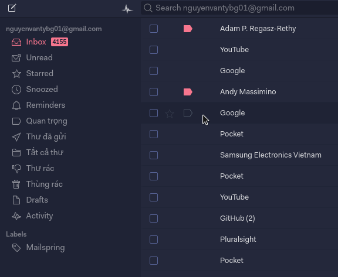

# Mailspring Theme Starter

The Mailspring Theme Starter is a basic starting point for creating a theme for
the [Mailspring](http://www.getmailspring.com/) email client.



## Installing

1. Download the [Mailspring](https://getmailspring.com/) email client.
2. Download or clone the latest version of the Tokyo-night theme from <https://github.com/asparc/Tokyo-night>.
3. Open `Mailspring > Edit > Install Theme...` and select the folder you just downloaded.
4. Enjoy a polished dark theme that's easy on your eyes!

## Structure

```
.
├── styles                 # All stylesheets
|   ├── index.less             # Main LESS file to import your stylesheets
│   ├── ui-variables.less  # UI variables that override N1's defaults
├── package.json           # Metadata about the theme
├── LICENSE.md             # License with usage rights
└── README.md              # Info about your theme and how to use it
```
